slidenumbers: true
autoscale: true

# Declare, verify and execute microservices-based process flows with Baker
## Scale By the Bay 2017, San Francisco
### Nikola Kasev | ING Bank

---


---

## Symptoms of a Failing Application Architecture

---


## Afraid to change the application code

---


## Functionality breaks unexpectedly

---


## Slow time to market

---

## How to turn this around?

---


---


---
	


---
	


---

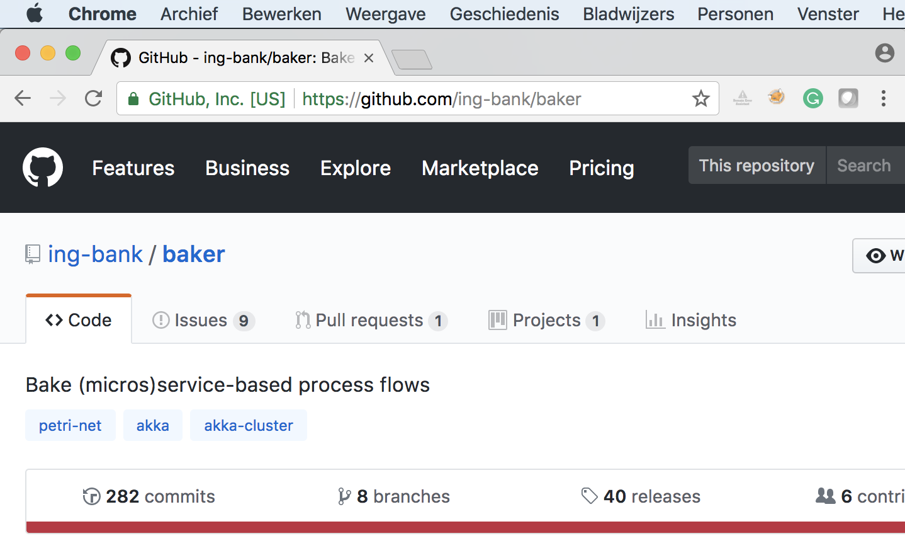

---


## Simplify
### Domain Specific Language for orchestration flows
### Declarative
### Easy to change

---


## Reuse
### Recipes
### Interactions
### Ingredients
### Events

---


## Communicate
### Visualize your code
### Non-IT understand as well
### Reason About Comfortably

---

## Design-time

---

```[.highlight: 1,6,7]
public interface RegisterIndividual extends Interaction {
    @FiresEvent(oneOf = {RegisterIndividualSuccessful.class,
            RegisterIndividualFailed.class})
    RegisterIndividualOutcome apply(
            @ProcessId String processId,
            @RequiresIngredient("name") String name,
            @RequiresIngredient("address") String address
    );
}

```

---

```[.highlight: 2,3]
public interface RegisterIndividual extends Interaction {
    @FiresEvent(oneOf = {RegisterIndividualSuccessful.class,
            RegisterIndividualFailed.class})
    RegisterIndividualOutcome apply(
            @ProcessId String processId,
            @RequiresIngredient("name") String name,
            @RequiresIngredient("address") String address
    );
}

```

---

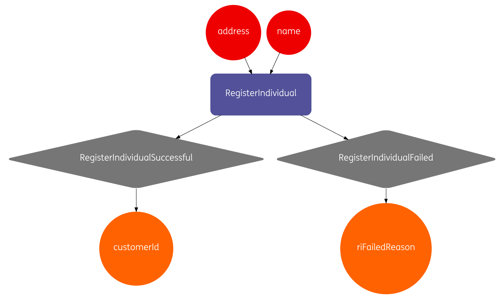

---

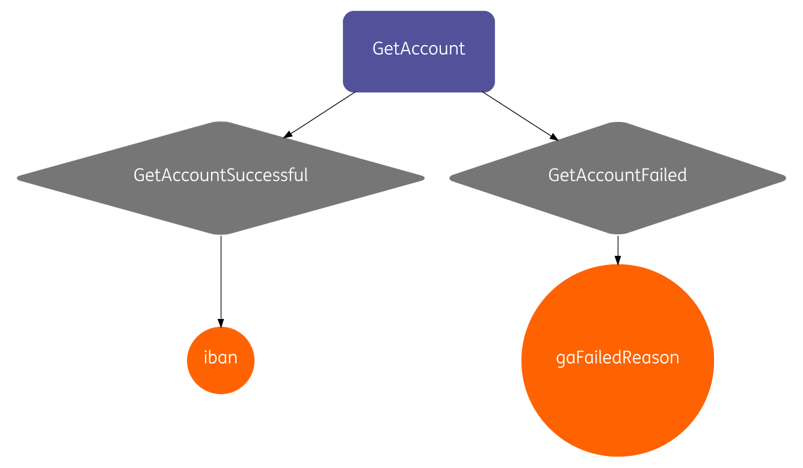

---

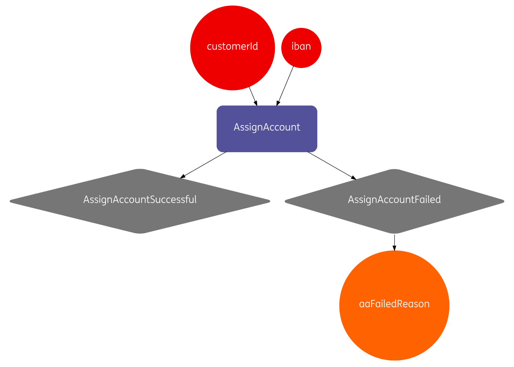

---

```java, [.highlight: 3-6]
public Recipe get(){
    return new Recipe("Demo").
            withInteractions(
                    of(AssignAccount.class),
                    of(GetAccount.class),
                    of(RegisterIndividual.class));
}
```

---

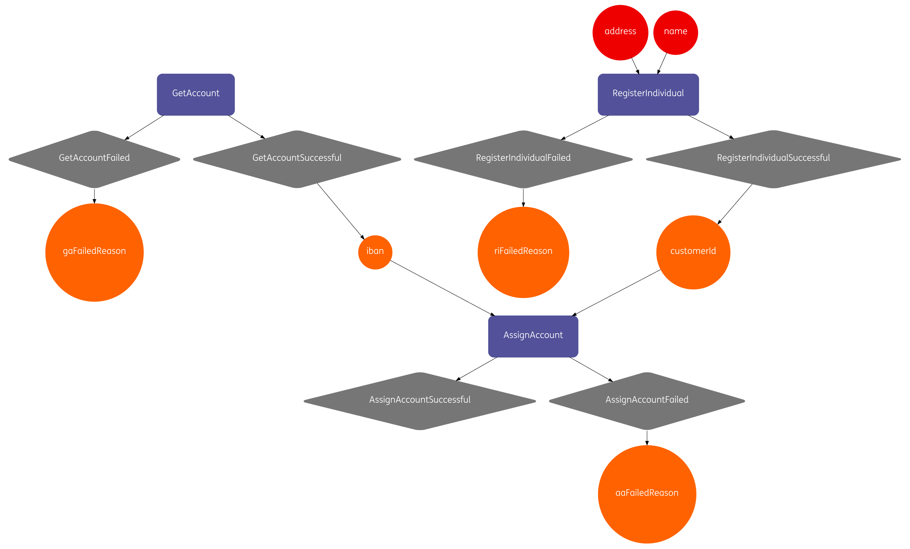

---

```java, [.highlight: 5, 7-9]
return new Recipe("Demo").
        withInteractions(
                of(AssignAccount.class),
                of(GetAccount.class).
                        withRequiredEvent(TermsAndConditionsAccepted.class),
                of(RegisterIndividual.class)).
        withSensoryEvents(
                TermsAndConditionsAccepted.class,
                IndividualInformationSubmitted.class);
}
```

---

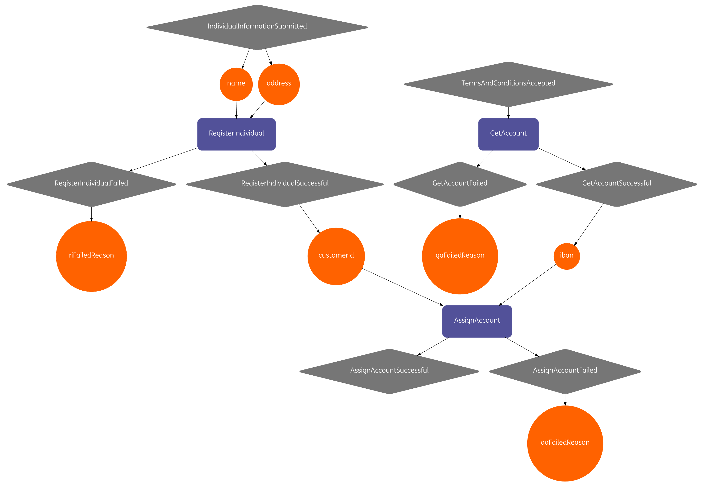

---

## Run-time

---

```java, [.highlight: 2,4,5,8,9,13]
//for each process instance, bake the recipe
baker.bake(processId);
//notify Baker when events occur
baker.processEvent(processId, new SensoryEvents.IndividualInformationSubmitted(name, address));
baker.processEvent(processId, new SensoryEvents.TermsAndConditionsAccepted());

//retrieve ingredients stored in the accumulated state
assert(baker.getIngredients(processId).get("customerId").equals(customerId));
assert(baker.getIngredients(processId).get("iban").equals(iban));

//retrieve all events that have occurred
Set<String> occurredEvents = new HashSet<>(
        baker.getEvents(processId).getEventNameList()
);
```

---


---

## Under the Hood

---	

### Why Scala?

- Best fit for developing DSLs[^1] on the JVM
- Compile-time recipe validation
- Type safety

[^1]: https://martinfowler.com/books/dsl.html

---

### Why Akka?

- Event Sourcing[^2] (events can be replayed)
- Persistent actors (with Cassandra)
- Distributed actors across machines (with cluster sharding)

[^2]: http://martinfowler.com/eaaDev/EventSourcing.html

---


## Best Practices

---

### Short-lived vs. long-running flows

---

### State is taken care of:

- Cassandra for persistent storage
- Ingredients encrypted by default
- State recovered automatically

---

### Run Baker inside of your API
### "Smart endpoints and dumb pipes"

---

### When failure occurs:

- Baker retries technical failures with exponential backoff
- Works well with **idempotent** services
- Deal with functional failure in your recipe

---

Baker Capability Matrix:

- Investigate not one, not two, but **all business processes** in your company
- Where do you see re-use?
- Map using MoSCoW[^4] to give importance (M = 10, S = 5, C = 2, W = 1)

[^4]: https://en.wikipedia.org/wiki/MoSCoW_method

---

| Checking Account | Savings Account | Customer Onboarding |
| :--- | :---: | ---: |
| Verify Identity | Verify Identity | Verify Identity |
| Register Individual | Register Individual | Register Individual |
| Open *Checking* Account | Open *Savings* Account | `n/a` |
| Issue Debit Card | `n/a` | `n/a` |
| Send Message | Send Message | Send Message |
| Register Product Owner | Register Product Owner | `n/a` |

---


## https://github.com/ing-bank/baker

---

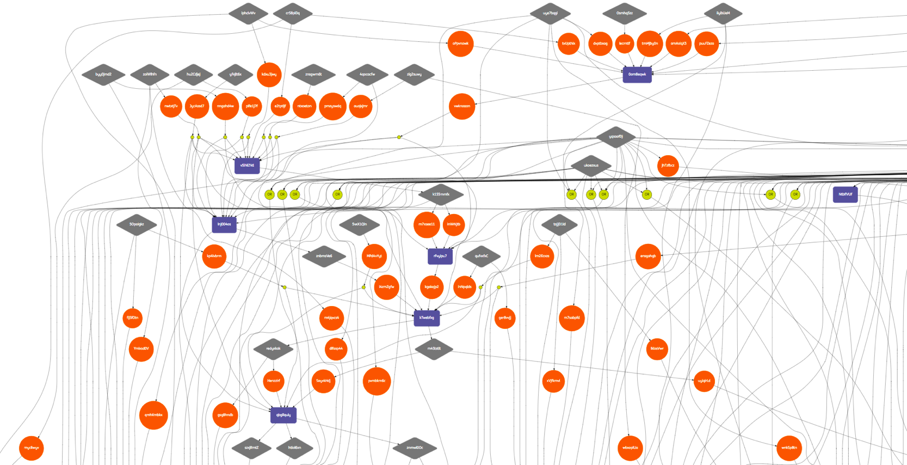

---

### Why Petri net?[^3]

[^3]: https://en.wikipedia.org/wiki/Petri_net

---

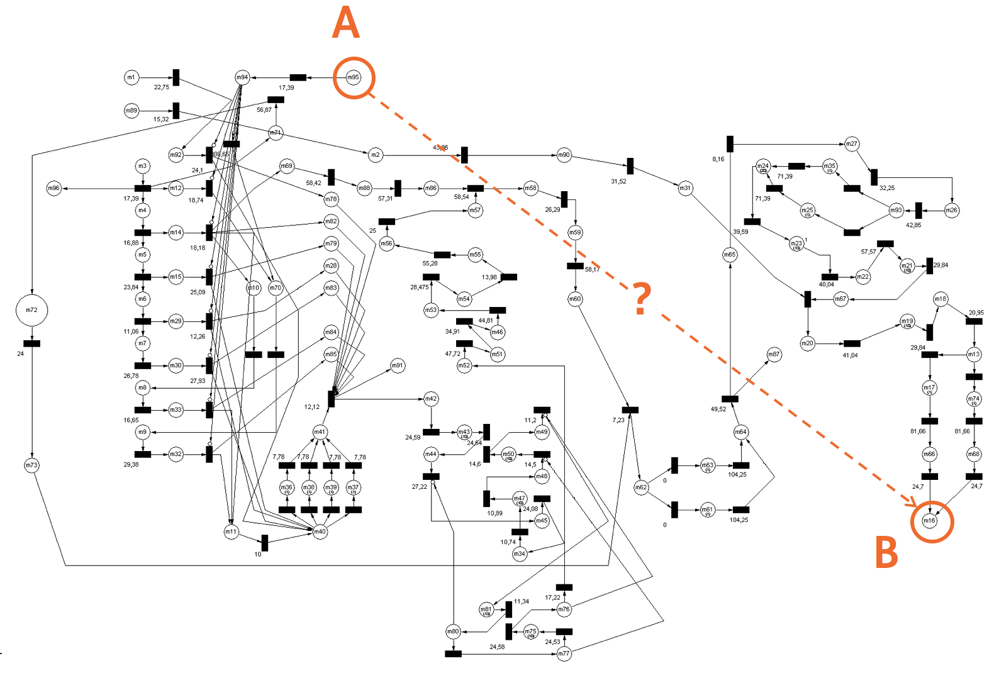

---

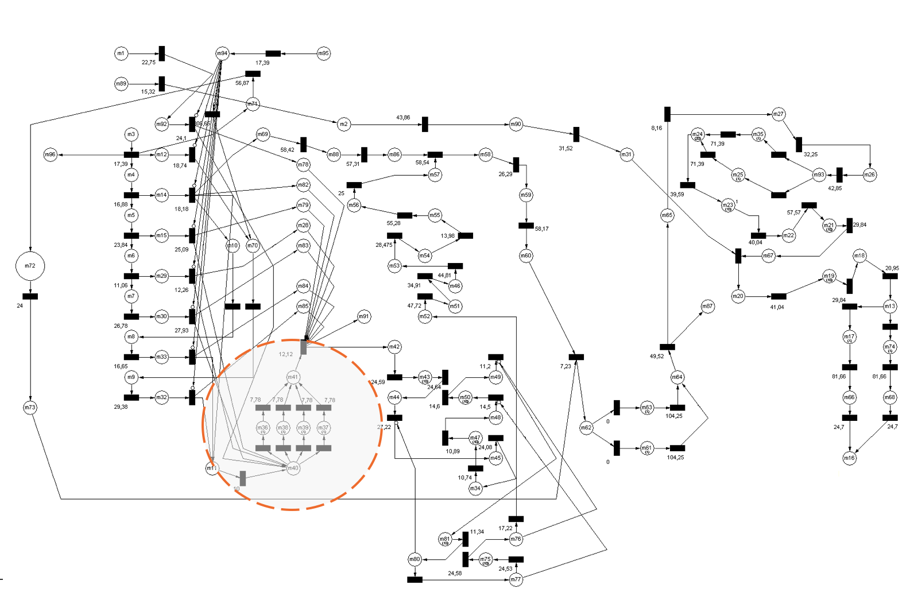

---

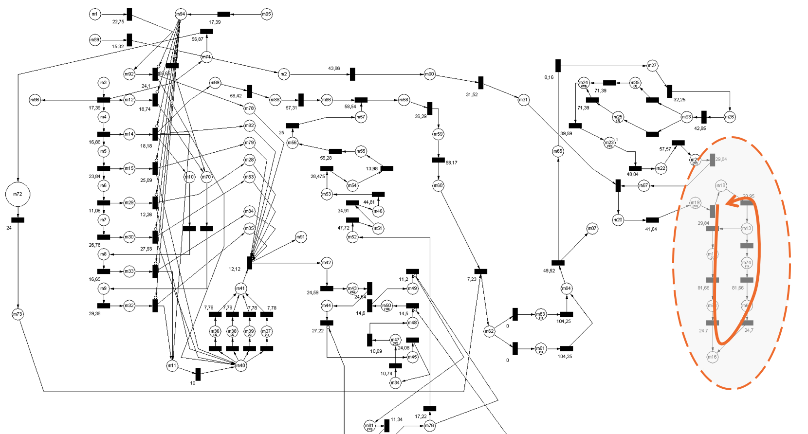


---

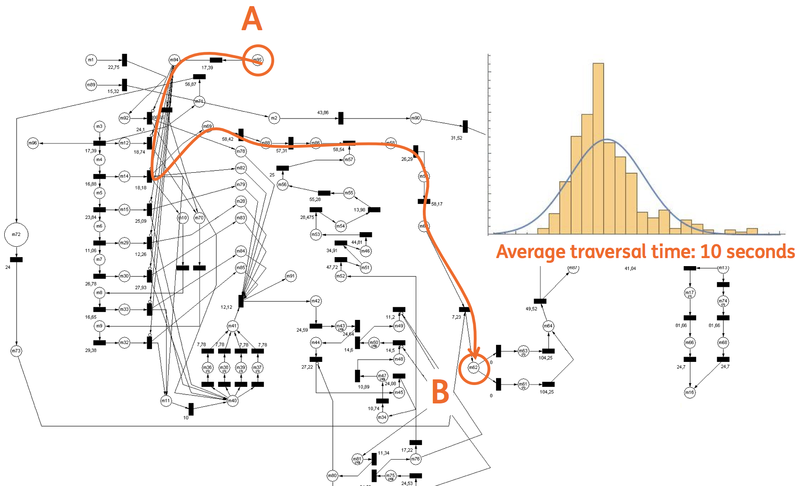

---

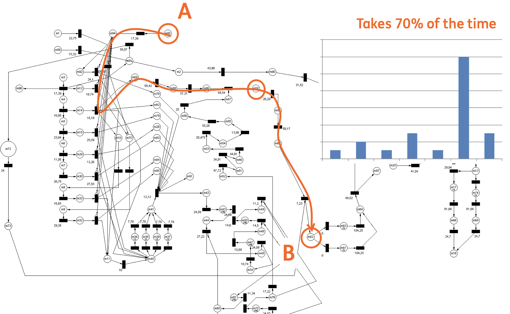

---

**I love cooking food** and for the rest of the talk I'll be using analogies from there. It's very **similar to our industry**: long hours, hard work, and delivering experiences to our customers.

Have you been woken up at 3 o'clock in the morning on a **Saturday morning** after a night of partying, having to go to the war room and resolve an application incident. I've been there. When I remember the cold of the **airconditioners**, it still **makes me shiver**.

If we are building microservices or a monolith or any type of application in general we are **serving business logic to our clients**. So no matter what, we cannot escape the **architectural discussion**. If we are not careful of how we architect our applications we end up serving a bad meal to our clients.


