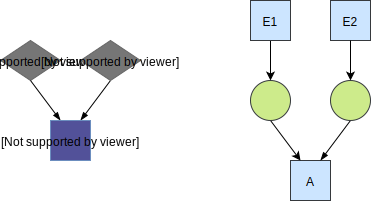
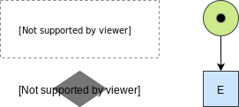

# Execution Semantics

### Execution loop

This is a short description of the execution loop of a `RecipeInstance`

1. An [event](concepts.md#event) is raised and provides ingredients.

    Either given to baker as a sensory event or by an interaction.

2. A check is done which interactions have all their requirements met and those are executed.
3. An interaction completes its execution and outputs an event (`GOTO 1.`)

### Notes

- A sensory event may be provided 1 or more times depending on its [firing limit](recipe-dsl.md#firing-limit).
- When ingredients are provided multiple times, the latest value overrides the previous.
- An interaction fires when all it's ingredients and required events are provided.
    This may happen 1 or more times depending on the [maximum interaction count](recipe-dsl.md#maximum-interaction-count).

To know more you will first need to understand the how a petri net works.

Below is an explanation of how a recipe relates to a petri net.

# In depth

A recipe can be represented (and [visualized](recipe-visualization.md)) as a graph.

This graph is actually a higher level representation of a [petri net](https://en.wikipedia.org/wiki/Petri_net) (which is also a graph).

The execution of a `RecipeInstance` based around this petri net.

The recipe compiler takes a recipe and creates a petri net.

Generally the petri net is graph more complicated with extra layers of wiring nodes.

## Translation rules

The compiler has some rules about translating recipe parts to `transitions` and `places` in the petri net.

### Ingredient used by multiple interactions

Often an ingredient will be used by multiple interactions in a recipe.

Because tokens can only be consumed by 1 transition we have to add a layer to duplicate the token for all transitions.

### Interaction with precondition (AND)

By default event preconditions use an AND combinator. In the petri net this means that each event transition has
to produce a token in a place for that interaction.

### Interaction with precodition (OR)

Events that are grouped in an OR combinator for an interaction output a token to the same place.

Therefor when one of them fires the condition for the transition to fire is met.

### Sensory event with firing limit

When specifying a sensory event with a firing limit of `n` we generate a in-adjacent place with `n` tokens in the
initial marking.

