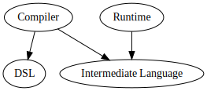

# Getting Started

## Project setup

Baker is released to [maven central](https://search.maven.org/search?q=com.ing.baker).

You can add following dependencies to your `maven` or `sbt` project to start using it:

``` scala tab="Sbt"
dependencies += "com.ing.baker" %% "baker-recipe-dsl" % "3.0.0"
dependencies += "com.ing.baker" %% "baker-compiler" % "3.0.0"
dependencies += "com.ing.baker" %% "baker-runtime" % "3.0.0"
```

``` maven tab="Maven"
<dependencies>
   <groupId>com.ing.baker</groupId>
   <artifactId>baker-recipe-dsl_2.12</artifactId>
   <version>3.0.0</version>
</dependencies>
<dependencies>
   <groupId>com.ing.baker</groupId>
   <artifactId>baker-compiler_2.12</artifactId>
   <version>3.0.0</version>
</dependencies>
<dependencies>
   <groupId>com.ing.baker</groupId>
   <artifactId>baker-runtime_2.12</artifactId>
   <version>3.0.0</version>
</dependencies>

```

This includes *ALL* baker modules to your project. If you only need partial functionality you can pick and choose the modules you need.

### Modules

An explanation of the baker modules.

| Module | Description |
| --- | --- |
| recipe-dsl | [DSL](documentstion_old/recipe-dsl.md) to describe your recipes (process blueprints) *declaritively* |
| runtime | [Runtime](documentstion_old/baker-runtime.md) based on [akka](htts://www.akka.io) to manage and execute your recipes |
| compiler | [Compiles your recipe](documentstion_old/baker-runtime.md#compiling-your-recipe) description into a model that the runtime can execute |
| intermediate-language | Recipe and Petri Net model that the runtime can execute |

This is the dependency graph between the modules.



## Continuing from here

After adding the dependencies you can continue to:

 - Familiarize yourself with the [concepts](/sections/concepts/main-abstractions).
 - Immediately start [writing your recipes](/sections/development-life-cycle/design-a-recipe/).