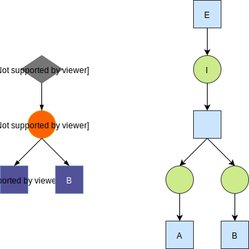
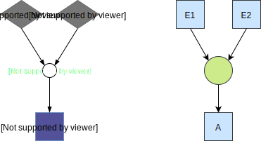

# Execution Semantics

## Execution loop

This is a short description of the execution loop of a `RecipeInstance`

1. An `EventInstance` is fired and provides ingredients, either given to baker as a sensory event or as an output 
   of an `InteractionInstance`.
2. Baker tries to match the currently available provided `IngredientInstances` with the input of awaiting `InteractionInstances`.
3. `InteractionInstances` that can be called, execute and when complete they fire more `EventInstances`, repeating the
   loop from step 1.
4. This continues until there are no more `InteractionInstances` to execute, and the process is considered complete.

### Notes

- A sensory event may be provided 1 or more times depending on its `firing limit`.
- When `IngredientInstances` are provided multiple times, the latest value overrides the previous.
- An `InteractionInstance` fires when all it's `IngredientInstances` and required `Events` are provided.
    This may happen 1 or more times depending on the `maximum interaction count`.

# In depth

This section explains deeply how `ProcessInstances` work, and how they execute your recipes. You DO NOT require to understand
this part to develop with Baker, it is just extra documentation for the curious and the contributor.

A recipe can be represented (and [visualized](recipe-visualization.md)) as a graph, which is actually a higher 
level representation of a [petri net](https://en.wikipedia.org/wiki/Petri_net) (which is also a graph). When the process
is represented as such it enables the `RecipeInstance` to execute the previously described execution loop, because Baker has
your process state as a data structure that can be preserved as the state of the `RecipeInstance`. That is why you need
to first use the `RecipeCompiler` and compile the recipe into a `CompiledRecipe` (petri net representation) before 
running a `RecipeInstance` from it.

## Translation rules

The compiler has some rules about translating recipe parts to `transitions` and `places` in the petri net.

### Ingredient used by multiple interactions

Often an ingredient will be used by multiple interactions in a recipe.

Because tokens can only be consumed by 1 transition we have to add a layer to duplicate the token for all transitions.

### Interaction with precondition (AND)

By default event preconditions use an AND combinator. In the petri net this means that each event transition has
to produce a token in a place for that interaction.

### Interaction with precodition (OR)

Events that are grouped in an OR combinator for an interaction output a token to the same place.

Therefor when one of them fires the condition for the transition to fire is met.

### Sensory event with firing limit

When specifying a sensory event with a firing limit of `n` we generate a in-adjacent place with `n` tokens in the
initial marking.

